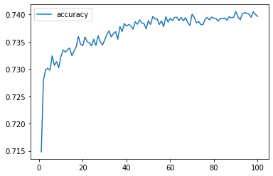

# charityFundingPredictor

# Charity Funding Predictor - Deep Learning Bootcamp Assignment

## Background

The nonprofit foundation Alphabet Soup wants a tool that can help it select the applicants for funding with the best chance of success in their ventures. With your knowledge of machine learning and neural networks, you’ll use the features in the provided dataset to create a binary classifier that can predict whether applicants will be successful if funded by Alphabet Soup.

From Alphabet Soup’s business team, you have received a CSV containing more than 34,000 organizations that have received funding from Alphabet Soup over the years. Within this dataset are a number of columns that capture metadata about each organization, such as:

* **`EIN`** and **`NAME`**—Identification columns
* **`APPLICATION_TYPE`**—Alphabet Soup application type
* **`AFFILIATION`**—Affiliated sector of industry
* **`CLASSIFICATION`**—Government organization classification
* **`USE_CASE`**—Use case for funding
* **`ORGANIZATION`**—Organization type
* **`STATUS`**—Active status
* **`INCOME_AMT`**—Income classification
* **`SPECIAL_CONSIDERATIONS`**—Special consideration for application
* **`ASK_AMT`**—Funding amount requested
* **`IS_SUCCESSFUL`**—Was the money used effectively

## Instructions

- Step 1: Preprocess the Data
- Step 2: Compile, Train, and Evaluate the Model
- Step 3: Optimize the Model
- Step 4: Write a Report on the Neural Network Model

## Full Report on the Neural Network Model

<b>Overview</b>

 The purpose of creating these NN models was to find a tool that could help select applicants for funding. After the first model was created, I tried a few optimization models to see if I could improve accuracy while maintaining a low loss rate. 

<b>Results</b>
 
<b>Method 1 - 73% Accuracy, 0.6% Loss</b>

<ul>🔸 Achieved by dropping non-beneficial ID columns "EIN" and "NAME"</ul>
<ul>🔸 “APPLICATION_TYPE“ and “CLASSIFICATION“ used for binning</ul>
<ul>🔸 Two hidden relu layers</ul>
<ul>🔸 100 epochs to train the model</ul>

<b>Method 2 - 78% Accuracy, 1.7% Loss</b>

<ul>🔹 Achieved by dropping one non-beneficial ID column “EIN“</ul>
<ul>🔹 “NAME“ and “APPLICATION_TYPE“ used for binning</ul>
<ul>🔹 Two hidden relu layers</ul>
<ul>🔹 100 epochs to train the model</ul>

<b>Method 3 – 78% Accuracy, 2% Loss</b>

<ul>🔸 Achieved by dropping one non-beneficial ID column “EIN“</ul>
<ul>🔸 “NAME“ and “APPLICATION_TYPE“ used for binning</ul>
<ul>🔸 Two hidden relu layers</ul>
<ul>🔸 200 epochs to train the model</ul>

<b>Method 4 – 78% Accuracy, 0.8% Loss</b>

<ul>🔹 Achieved by dropping more columns "EIN", "STATUS" and "SPECIAL_CONSIDERATIONS"</ul>
<ul>🔹 “NAME“ and “APPLICATION_TYPE“ used for binning</ul>
<ul>🔹 Three hidden relu layers</ul>
<ul>🔹 100 epochs to train model</ul>

<b>Method 5 – 79% Accuracy, 0.5% Loss</b>

<ul>🔸 Achieved by dropping one non-beneficial ID column “EIN“</ul>
<ul>🔸 “APPLICATION_TYPE“ and “CLASSIFICATION“ used for binning</ul>
<ul>🔸 Used kerastuner to obtain the best hyperparameters</ul>
<ul>🔸 Maximum of 20 epochs to train the model</ul>
<ul>🔸 Maximum of 30 hidden layers and neutrons</ul>
<ul>🔸 Uses relu and tanh to train model</ul>
<ul>🔸 Test trials split into two – 25 each round with tanh performing best in both trials</ul>

<b>Summary</b>

Overall, the best results were seen when kerastuner was used to perform test as it uses various epochs and relu and tanh for activation layers to test. While watching trials it was clear that tanh performs best, noticeably with a smaller number of epochs. I was successul at achieving over 75% accuracy with all optimization models, if I had more time I would like to see if it is possible to achieve 80-90% accuracy while maintaining a low loss rate.

